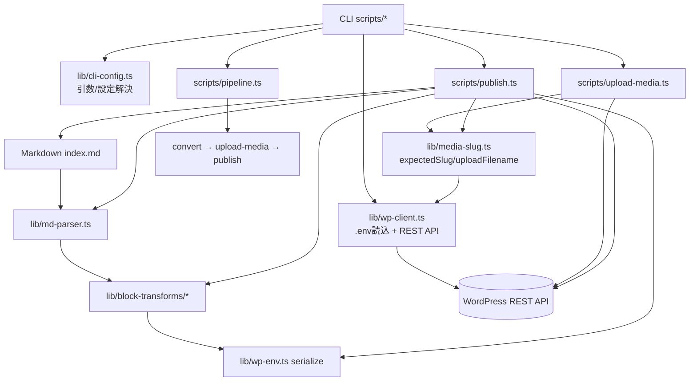

# 技術仕様書

実装仕様。各 Issue の実装時に参照する。

## 前提条件

| 項目           | 内容                                          |
| -------------- | --------------------------------------------- |
| テーマ         | FSE ブロックテーマ                            |
| REST API       | Application Password 認証                     |
| 必須プラグイン | KaTeX（数式レンダリング、ショートコード対応） |
| 任意プラグイン | Syntax Highlighting Code Block（Prism.js）    |
| 非対応         | メディアファイル名を自動変更するプラグイン    |

## 記事ディレクトリ規約

```text
posts/
├─ <article-slug>/
│   ├─ index.md             ← frontmatter + 本文
│   └─ images/
│       └─ *.jpg / *.png
└─ shared/                  ← 記事横断の共通リソース
    └─ logo.png
```

- 各記事は `posts/<slug>/` ディレクトリに `index.md` として配置
- 画像は同ディレクトリ内の `images/` に格納
- 共通リソース（汎用フリー画像等）は `posts/shared/` に配置し、各記事から `../shared/logo.png` のように相対パスで参照

## Frontmatter 仕様

```yaml
---
title: '記事タイトル'
slug: 'article-slug'
categories:
    - diary
tags:
    - tag1
featured_image: 'images/cover.jpg' # 任意
excerpt: '抜粋テキスト...' # 任意
date: '2026-02-10' # 任意（未指定なら投稿時の日時）
---
```

| フィールド       | 型       | 必須 | 説明                                       |
| ---------------- | -------- | ---- | ------------------------------------------ |
| `title`          | string   | ○    | 記事タイトル                               |
| `slug`           | string   | ○    | URL スラッグ（ディレクトリ名と一致させる） |
| `categories`     | string[] | ○    | カテゴリ slug の配列                       |
| `tags`           | string[] |      | タグ slug の配列                           |
| `featured_image` | string   |      | アイキャッチ画像の相対パス                 |
| `excerpt`        | string   |      | 抜粋テキスト                               |
| `date`           | string   |      | 投稿日（ISO 8601、未指定なら投稿時の日時） |

## Markdown 対応記法と変換ルール

### 基本ブロック

| Markdown                      | Gutenberg ブロック | 変換仕様                                                    |
| ----------------------------- | ------------------ | ----------------------------------------------------------- |
| 段落テキスト                  | `core/paragraph`   | `{ content: "<inline HTML>" }`                              |
| `# 見出し` 〜 `###### 見出し` | `core/heading`     | `{ content: "<inline HTML>", level: 1-6 }`                  |
| ` ```lang ... ``` `           | `core/code`        | `{ content: "<escaped code>", className: "language-lang" }` |

#### インライン要素

paragraph / heading の `content` 内で以下のインライン要素を HTML に変換する。

| Markdown      | HTML                     |
| ------------- | ------------------------ |
| `**bold**`    | `<strong>bold</strong>`  |
| `*italic*`    | `<em>italic</em>`        |
| `` `code` ``  | `<code>code</code>`      |
| `[text](url)` | `<a href="url">text</a>` |
| `~~strike~~`  | `<s>strike</s>`          |

### テーブル・リスト・画像

#### テーブル

GFM テーブル → `core/table`

```markdown
| Header 1 | Header 2 |
| -------- | -------- |
| Cell 1   | Cell 2   |
```

#### リスト

`- item` / `1. item` → `core/list` + `core/list-item`（ネスト対応）

#### 画像

`` → `core/image`

- `path`: ローカル相対パス（`images/photo.jpg` や `../shared/logo.png`）
- `"caption"`: Markdown の title 位置をキャプションとして使用
- デフォルト属性:

| 属性       | 値                     |
| ---------- | ---------------------- |
| `sizeSlug` | `medium`               |
| `align`    | `center`               |
| `lightbox` | `true`（全画像で有効） |

画像パスは変換時点ではローカルパスのまま。メディア URL への置換は投稿時に実施。

### 数式・Embed・HTML・カラム

#### 数式（KaTeX）

| 記法                  | 変換先                                        | 配置                                |
| --------------------- | --------------------------------------------- | ----------------------------------- |
| `$E=mc^2$`            | `[katex]E=mc^2[/katex]`                       | `core/paragraph` 内にインライン配置 |
| `$$\int_0^1 f(x)dx$$` | `[katex display=true]\int_0^1 f(x)dx[/katex]` | `core/shortcode` ブロック           |

#### Embed（oEmbed）

単独行の URL → `core/embed`

```markdown
https://www.youtube.com/watch?v=xxxxx
```

- URL 属性のみの最小構成
- プロバイダ判定は WP 側に委譲（ドメイン→providerNameSlug 変換は自前実装しない）

#### HTML パススルー

`<iframe>` 等の HTML タグ → `core/html`

```markdown
<iframe src="https://example.com/embed" width="640" height="480"></iframe>
```

- タグをそのまま `core/html` ブロックの content に格納

#### カラム（columns）

`:::columns` directive → `core/columns` + `core/column`

```markdown
:::columns


:::
```

- `markdown-it-container` プラグインで `:::columns` をパース
- 内部の各画像を個別の `core/column` に配置

## メディアアップロード仕様

### API

| 操作         | エンドポイント                        | 用途                              |
| ------------ | ------------------------------------- | --------------------------------- |
| 既存チェック | `GET /wp/v2/media?slug=<slug>`        | slug 完全一致で既存メディアを検索 |
| アップロード | `POST /wp/v2/media`                   | 画像を 1 枚ずつ送信               |
| 削除         | `DELETE /wp/v2/media/<id>?force=true` | `--force-upload` 時に使用         |

### ファイル名命名規則

アップロード時のファイル名にプレフィックスを付与する。

| 画像の種別 | ローカルパス例                     | アップロード時ファイル名 |
| ---------- | ---------------------------------- | ------------------------ |
| 記事固有   | `posts/article-a/images/photo.jpg` | `article-a-photo.jpg`    |
| 共通       | `posts/shared/logo.png`            | `shared-logo.png`        |

- 記事画像: `<article-slug>-<filename>`
- 共通画像: `shared-<filename>`
- プレフィックスにより、異なる記事の同名画像がサーバ上で衝突しない

### フロー

1. MD 本文中の画像参照（`images/` 内および `../shared/` 内）を走査し、ローカル相対パスを解決
1. 命名規則に従いアップロード用ファイル名を決定（記事画像: `<slug>-<filename>`、共通画像: `shared-<filename>`）
1. ファイル名から期待される WP メディア slug を算出
1. `GET /wp/v2/media?slug=<expected-slug>` で既存チェック（完全一致）
1. 既存ならスキップ、未登録ならアップロード
1. アップロード後、レスポンスの slug が期待値と一致するか検証（不一致ならエラー終了）
1. スキップ・アップロード・エラーの結果をログ出力

### 同名画像の衝突ポリシー

- デフォルト: slug 一致するメディアが既存の場合スキップ
- `--force-upload` オプションで強制再アップロード
- ハッシュ比較は行わない（slug 一致 = 同一画像とみなす）

### `--force-upload` の動作

既存メディアを DELETE してから再アップロードすることで、WP のサフィックス自動付与（`-1`, `-2`）を回避する。

```text
1. GET /wp/v2/media?slug=<expected-slug> → id: 456
2. DELETE /wp/v2/media/456?force=true
3. POST /wp/v2/media（同じファイル名で新規アップロード）
4. レスポンスの slug を検証
```

## 記事投稿仕様

### API

| 操作     | エンドポイント          |
| -------- | ----------------------- |
| 新規投稿 | `POST /wp/v2/posts`     |
| 更新     | `PUT /wp/v2/posts/<id>` |

### Frontmatter → API フィールドマッピング

| frontmatter      | API フィールド   | 変換                                                  |
| ---------------- | ---------------- | ----------------------------------------------------- |
| `title`          | `title`          | そのまま                                              |
| `slug`           | `slug`           | そのまま                                              |
| `categories`     | `categories`     | slug → ID 解決（`GET /wp/v2/categories?slug=<slug>`） |
| `tags`           | `tags`           | slug → ID 解決（`GET /wp/v2/tags?slug=<slug>`）       |
| `featured_image` | `featured_media` | メディア ID に解決                                    |
| `excerpt`        | `excerpt`        | そのまま                                              |
| `date`           | `date`           | ISO 8601 形式                                         |
| （本文）         | `content`        | serialize() の出力（ブロック HTML）                   |

### 投稿ステータス

- 常に `status: "draft"` で投稿
- 公開は WP 管理画面から手動で行う

### 新規/更新判定

- `GET /wp/v2/posts?slug=<slug>` でサーバに問い合わせ
- 既存記事が見つかれば `PUT /wp/v2/posts/<id>`（更新）、なければ `POST`（新規）

### 画像 URL 置換

投稿時に、ブロック HTML 内のローカル画像パスを WP メディア URL に置換する。

1. ローカルパスから命名規則に基づき WP メディア slug を算出
1. `GET /wp/v2/media?slug=<slug>` でメディア URL を取得
1. ブロック HTML 内のローカルパスを取得した URL に置換

## E2E 統合・CLI 仕上げ

### 統合実行モード

`pipeline` コマンドで以下を順次実行する。

1. `convert`（Markdown → ブロック変換確認）
1. `upload-media`（画像アップロード）
1. `publish`（draft 投稿）

### プラグイン同期（sync）

`sync` コマンドは WordPress の `GET /wp/v2/plugins` からプラグイン情報を取得し、`.mdpub-cache.json` に書き出す。

- `pipeline` 実行時に自動で先頭ステップとして実行される
- 単独実行: `npm run sync` / `mdpub sync`

### content root 設定

`posts/` の配置場所は以下の優先順位で解決する。

1. CLI 引数 `--content-root`
1. 環境変数 `MDPUB_CONTENT_ROOT`
1. デフォルト `posts`

## 設定ファイル

### `.env`（ユーザ設定）

WordPress 接続情報と content root を管理する。`mdpub init` で `.env.example` を生成。

### `.mdpub-cache.json`（sync 生成キャッシュ）

`sync` コマンドが生成するサーバ状態キャッシュ。手動編集は不要。

```json
{
    "generatedAt": "2026-02-17T00:00:00.000Z",
    "plugins": ["katex"]
}
```

| フィールド    | 型       | 説明                                   |
| ------------- | -------- | -------------------------------------- |
| `generatedAt` | string   | 生成日時（ISO 8601）                   |
| `plugins`     | string[] | mdpub が認識する有効プラグイン名の配列 |

### プラグイン自動検出

`sync` が WP のプラグイン一覧から active なプラグインを検出し、mdpub 内部名にマッピングする。

| WP plugin slug | mdpub プラグイン名 | 効果                                                              |
| -------------- | ------------------ | ----------------------------------------------------------------- |
| `katex/katex`  | `katex`            | `$...$` → `[katex]...[/katex]`、`$$...$$` → `core/shortcode` 変換 |

未知のプラグインや inactive なプラグインは無視される。`sync` 未実行時は空 Set（プラグインなし動作）。

### `contentRoot` 解決優先順位

1. CLI 引数 `--content-root`
1. 環境変数 `MDPUB_CONTENT_ROOT`
1. デフォルト `posts`

## 環境変数仕様

### WordPress 接続情報

| 環境変数          | 必須 | 用途                 |
| ----------------- | ---- | -------------------- |
| `WP_URL`          | ○    | WP サイト URL        |
| `WP_USER`         | ○    | WP ユーザー名        |
| `WP_APP_PASSWORD` | ○    | Application Password |

### 読み込み優先順位

- スクリプト起動時に `.env` を読み込む
- ただし `process.env` に既に値があるキーは上書きしない
- そのため、優先順位は「プロセス環境変数 > `.env`」

## アーキテクチャ / 処理フロー



## ステートレス設計

ローカルに状態ファイルを持たず、毎回サーバに問い合わせる。

### 設計方針

- **source of truth はサーバ**。ローカルに ID や URL のキャッシュを保持しない
- 命名規則（`<slug>-<filename>` / `shared-<filename>`）により、ローカルパスから WP メディア slug を決定論的に算出できる
- サーバ問い合わせには `slug` パラメータ（完全一致）を使用。`search`（部分一致）は使わない

### 制御の境界

**ツール側が制御するもの:**

- 記事 slug — frontmatter で明示定義
- メディアファイル名 — ローカルファイルシステム上の名前
- 命名規則 — `<article-slug>-<filename>` / `shared-<filename>`
- → ローカルパスから WP メディア slug への変換は決定論的な純粋関数

**WordPress が制御するもの:**

- slug のグローバル一意性制約（投稿・固定ページ・メディア等の全 post type で一意）
- slug の sanitize（小文字化、記号→ハイフン変換、連続ハイフンの圧縮）
- メディア ID・URL の付与

### 既知の破壊ポイント

ツール側の slug 算出と WP 側の slug 付与が一致しない場合、ステートレス設計は機能しない。

| 状況                                                      | 影響                                               | 対処                                                                                               |
| --------------------------------------------------------- | -------------------------------------------------- | -------------------------------------------------------------------------------------------------- |
| メディア slug が他の post type と衝突し WP が `-2` を付与 | 次回実行時に既存メディアを発見できず再アップロード | アップロード後にレスポンスの slug を検証し、不一致ならエラー終了。ユーザーが衝突元を解消して再実行 |
| WP 管理画面からメディアの slug を手動変更                 | 同上                                               | 運用規約: 本ツール管理下のメディアは WP 側で slug を変更しない                                     |
| WP の将来バージョンで media slug 生成ロジックが変更       | slug 算出が不可能になる                            | その時点でキャッシュ層を追加する対応（現時点では YAGNI）                                           |

個人ブログで自分だけが操作する前提では、いずれも発生頻度は極めて低い。アップロード後の slug 検証により、問題が発生した場合は即座に検知できる。

## 認証

`.env` ファイルで管理（`.env.example` 参照）。

REST API リクエストは Basic 認証（`Authorization: Basic base64(user:app_password)`）を使用する。

## ローカルテスト環境（wp-env）

### セットアップ

```bash
npx wp-env start
```

起動後 `http://localhost:8888` でアクセス可能。管理画面は `http://localhost:8888/wp-admin`（admin / password）。

### パーマリンク設定

REST API の `/wp-json/` パスを有効にするため、パーマリンクを `/%postname%/` に設定する必要がある。

**Git Bash では `%` が環境変数として展開されるため、`npx wp-env run cli` 経由で直接 `%postname%` を渡せない。** Docker コンテナ内で bash を介して実行する。

```bash
WP_ENV_PATH=$(npx wp-env install-path 2>/dev/null)
docker compose -f "$WP_ENV_PATH/docker-compose.yml" exec -T cli bash -c \
  "wp option update permalink_structure '/%postname%/'"
docker compose -f "$WP_ENV_PATH/docker-compose.yml" exec -T cli bash -c \
  "wp rewrite flush --hard"
```

### Application Password 発行

```bash
WP_ENV_PATH=$(npx wp-env install-path 2>/dev/null)
docker compose -f "$WP_ENV_PATH/docker-compose.yml" exec -T cli bash -c \
  "wp user application-password create admin mdpub --porcelain"
```

出力されたパスワードを `.env` の `WP_APP_PASSWORD` に設定する。

### テストデータ準備

```bash
# カテゴリ（uncategorized は WP デフォルトで存在）
# タグ作成
WP_ENV_PATH=$(npx wp-env install-path 2>/dev/null)
docker compose -f "$WP_ENV_PATH/docker-compose.yml" exec -T cli bash -c \
  "wp term create post_tag test"
```

### 制約事項

| 制約                 | 詳細                                                                                                                              |
| -------------------- | --------------------------------------------------------------------------------------------------------------------------------- |
| Git Bash の `%` 展開 | `npx wp-env run cli` に `%postname%` 等を渡す場合は `docker compose exec -T cli bash -c "..."` を使用                             |
| REST API パス        | パーマリンク未設定の場合 `/wp-json/` が 404 になる。`?rest_route=` パラメータ経由でアクセスは可能（フォールバック機能で自動対応） |
